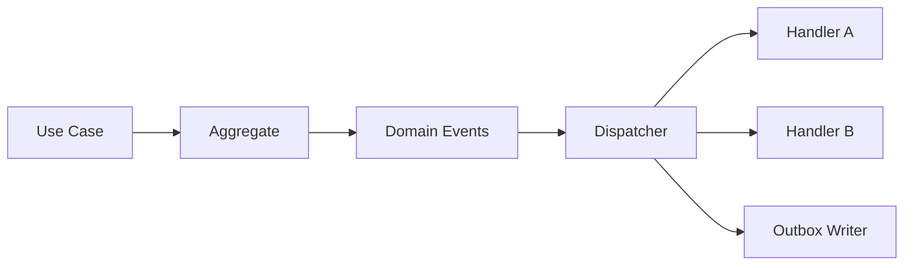

# Event Bus & Dispatch

## Başlangıç Yaklaşımı
Modüler monolith içinde in-process dispatcher kullanılacaktır.

## Handler Kuralları
- Handler tek sorumluluk taşır.
- Handler doğrudan HTTP yanıtı üretmez.
- Handler başarısız olduğunda hata kayda alınır.
- Kritik yan etkiler outbox üzerinden yürütülür.
- Aynı event tekrar geldiğinde sonuç bozulmamalıdır.

## Senkron ve Asenkron Ayrımı
Senkron:
- Aynı transaction içindeki invariant kontrolleri.

Asenkron:
- Bildirim
- Görsel/TTS üretimi
- Analitik
- Uzun süreli dünya simülasyonu
