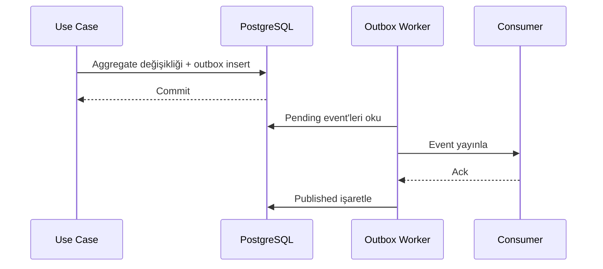

# Transactional Outbox Pattern

## Amaç
Veritabanı güncellemesi ile event yayınının ayrışmasını önlemek.

## Outbox Tablosu
- id
- event_type
- event_version
- aggregate_id
- payload_json
- occurred_at
- published_at
- retry_count
- last_error

## Operasyon
- Polling aralığı konfigüre edilir.
- Batch işleme yapılır.
- Retry exponential backoff kullanır.
- Maksimum retry sonrası dead-letter durumuna geçilir.
