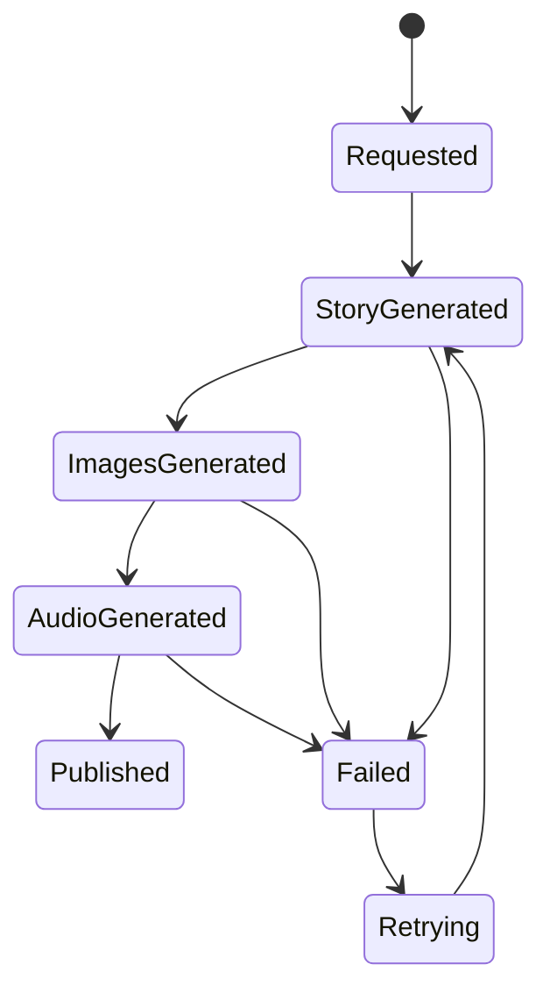

# Saga & Workflow

## Kullanım Alanları
- Hikâye üretimi → görsel üretimi → TTS → yayınlama
- Ebeveyn onayı gerektiren içerik
- Provider fallback zinciri
- Uzun süreli world simulation işlemleri

## Process Manager State
- workflow_id
- workflow_type
- status
- current_step
- retry_count
- context_json
- created_at
- updated_at

## Örnek Akış

## Kural
Saga yalnızca çok adımlı ve geri kazanım gerektiren süreçlerde kullanılır; basit use case'lerde kullanılmaz.
