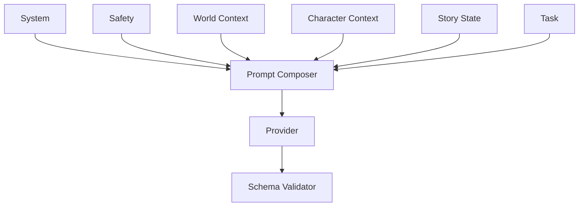

# Prompt Architecture

## Katmanlar
1. System Contract
2. Safety Policy
3. World Context
4. Character Context
5. Story State
6. Task Instruction
7. Output Schema

## Şablon Metadata
- prompt_id
- version
- locale
- target_model_family
- output_schema
- safety_profile
- status
